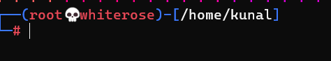

# Fun with the Linux Terminal: Changing Your Prompt Color and Symbol

Welcome to the wacky world of Linux terminal customization! 🎨 In this tutorial, we’ll guide you through two easy (and super fun) tricks:

1. **How to change the color of your terminal prompt.** 🌈
2. **How to change the symbol in your prompt.** 💀

Get ready to make your terminal the coolest one on the block! 🚀
---
## Output:





---

## Table of Contents

1. [Introduction](#introduction)
2. [Changing the Prompt Color](#changing-the-prompt-color)
3. [Changing the Prompt Symbol](#changing-the-prompt-symbol)
4. [Conclusion](#conclusion)

---


## Introduction

Ever get bored of that dull, plain terminal prompt staring at you every day? 😴 Time to give it a makeover! Whether you're just flexing your creativity or trying to impress your fellow geeks, changing your terminal prompt is surprisingly easy.

In this guide, we'll show you how to:

- Add some **color** to your prompt and brighten up your terminal life. 🌈
- Swap out that plain old `$` symbol with something a bit more… you! 😎

Let’s dive in and add some personality to your terminal.

---

## Changing the Prompt Color

### Step 1: Understand the Bash Prompt

Your terminal prompt is controlled by an environment variable called `PS1`. This is what determines how your prompt looks. Don’t worry—no deep technical jargon here! We’ll just tweak it a bit.

Here’s what your basic `PS1` might look like:

```bash
PS1='\u@\h:\w\$ '
```

That fancy little code means:
- `\u` = your username
- `\h` = your hostname (the name of your computer)
- `\w` = the current working directory
- `\$` = the prompt symbol

Let’s add some **color** to that bland prompt!

### Step 2: Add Some Color Magic

To add color, we need to insert some special codes. Don’t worry, it’s easier than it looks!

Here’s a basic color code you can use:

```bash
PS1='\[\e[0;32m\]\u@\h:\w\$ \[\e[m\]'
```

Let’s break that down:
- `\[\e[0;32m\]` = Set the text color to green 🌳.
- `\[\e[m\]` = Reset the color back to normal after the prompt.

### Step 3: Apply It

You can test it out right in your terminal:

```bash
PS1='\[\e[0;32m\]\u@\h:\w\$ \[\e[m\]'
```

Boom! Your prompt should now be green. 🎉

### Step 4: Make It Permanent

Now, let’s make sure this change sticks around. Open your `~/.bashrc` file with your favorite text editor (or the one you know):

```bash
nano ~/.bashrc
```

Scroll to the bottom and add your new fancy, colorful `PS1` line:

```bash
PS1='\[\e[0;32m\]\u@\h:\w\$ \[\e[m\]'
```

Save and close the file (in **nano**, that’s `CTRL + X`, then `Y`, then `Enter`). Now, apply the changes:

```bash
source ~/.bashrc
```

And voilà! Your prompt is now forever **green and glorious**! 🌟

---

## Changing the Prompt Symbol

### Step 1: Embrace Your Inner Emoji or Symbol Lover

That boring `$` sign is so last decade. Let’s spice it up by changing it to something that reflects your true style! Maybe a skull 💀? Or a lightning bolt ⚡? The possibilities are endless.

The last part of your prompt variable (`\$`) is the symbol, so let's swap it out!

### Step 2: Swap the Symbol

Change the symbol from `$` to something fun like a skull emoji (`💀`):

```bash
PS1='\u@\h:\w 💀 '
```

Now, your terminal prompt would look like this:

```
yourname@hostname:/your/current/directory 💀
```

### Step 3: Test It Out

Run this in your terminal:

```bash
PS1='\u@\h:\w 💀 '
```

Boom! Now your prompt ends with a **skull** 💀, and you’ve officially leveled up your terminal game. ⚔️

### Step 4: Make It Permanent

To make this cool new symbol a permanent fixture in your life, follow the same steps as before:

1. Open `~/.bashrc`:

    ```bash
    nano ~/.bashrc
    ```

2. Find or replace your current `PS1` with this one:

    ```bash
    PS1='\u@\h:\w 💀 '
    ```

3. Save the file and apply the changes:

    ```bash
    source ~/.bashrc
    ```

Now you have a **permanently awesome prompt symbol** that matches your terminal’s vibe. 🕶️

---

## Conclusion

And there you have it! 🎉 You’ve officially:
- Changed your boring prompt color to something bright and fun 🌈.
- Swapped out the default prompt symbol for something way cooler 💀.

Next time you open your terminal, it’ll be like walking into a **party for your code**. 🎊

Have fun customizing your terminal, and feel free to experiment with different colors and symbols. Who says terminals have to be boring? 😎

---

### Bonus: Helpful Color Codes

Here are some basic color codes you can use to change the prompt to any color you like:

- `\[\e[0;31m\]` = Red 🔴
- `\[\e[0;32m\]` = Green 🟢
- `\[\e[0;33m\]` = Yellow 🟡
- `\[\e[0;34m\]` = Blue 🔵
- `\[\e[0;35m\]` = Purple 🟣
- `\[\e[0;36m\]` = Cyan 🟦

Just replace the color code in the `PS1` variable to match your mood!

---

Happy customizing! 🎨✨


This tutorial gives a playful and humorous guide to changing the prompt color and symbol in a Linux terminal. The tone keeps it light while still providing practical, step-by-step instructions. Let me know if you want any tweaks!

